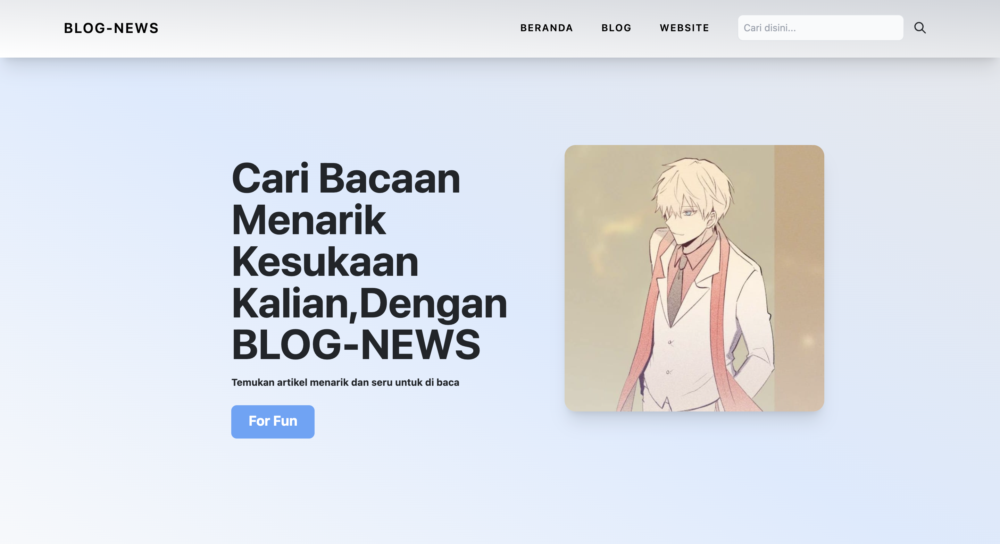

# Blog-News

**Blog-News** is an innovative and modern blog website designed to provide the latest news articles in the Indonesian language. The website is built using **HTML**, **CSS**, **JavaScript**, and **TailwindCSS** to ensure a seamless and engaging user experience.

## Features of Blog-News

- **Home Page**:

  - An inviting homepage that welcomes visitors with a sleek and modern design.
  - Highlights of the latest and most popular news articles.
  - Easy navigation to different sections of the website.

- **News Articles**:

  - A wide range of news articles covering various topics such as politics, technology, entertainment, sports, and more.
  - Each article is presented with a clear layout, high-quality images, and engaging content to keep readers informed and interested.

- **Interactive Elements**:

  - Integration of JavaScript to provide dynamic and interactive features such as real-time news updates, animated transitions, and user-friendly forms.
  - Ensuring a more engaging experience by incorporating interactive elements that respond to user actions.

- **Category Pages**:

  - Organized sections for different news categories, allowing users to easily find articles that match their interests.
  - Each category page is designed to present articles in an organized manner, making it easy for readers to navigate and find relevant content.

## Technical Details

- **HTML**:

  - Structured and semantic HTML5 elements to enhance accessibility and search engine optimization (SEO).
  - Proper use of tags to create a logical and clear structure for the website content.

- **CSS**:

  - Custom styles developed to create a unique and attractive look and feel.
  - TailwindCSS used to streamline the styling process and ensure a consistent design throughout the website.
  - Utilization of modern CSS techniques such as Flexbox and Grid for layout management.

- **JavaScript**:
  - Adding interactivity and dynamic content to the website.
  - Enhancing user engagement through features such as interactive menus, form validations, and content updates.

## Why Choose Blog-News

- **Comprehensive Coverage**: Provides a wide range of news articles covering various important topics to keep readers well-informed.
- **Modern Design**: Combines the power of TailwindCSS with custom styling to deliver a visually appealing and user-friendly website.
- **User Experience**: Focused on providing an intuitive and enjoyable browsing experience with easy navigation, fast load times, and interactive features.

---

Visit **Blog-News** to stay updated with the latest news articles in Indonesian and enjoy a rich, engaging reading experience.
